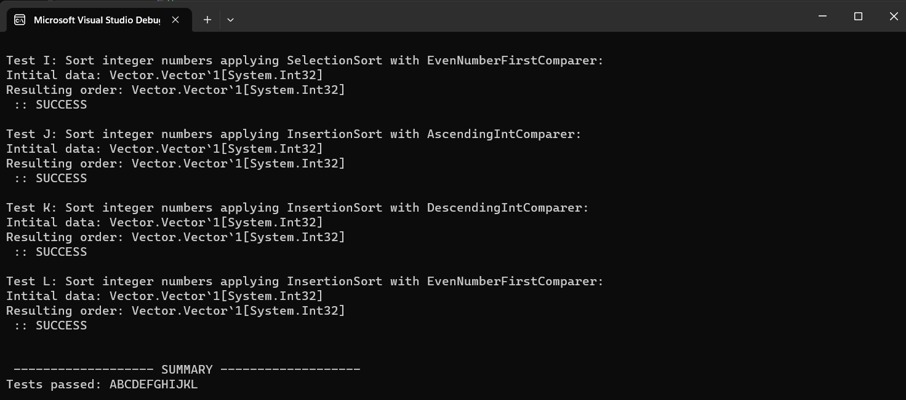

# SIT221 Data Structures and Algorithms - Basic Sorting Algorithms

Overview
This repository contains the implementation of sorting algorithms (Bubble Sort, Insertion Sort, and Selection Sort) in C# for the Vector class. The Vector class is an extension of the class implemented in Task 1.1P and includes an association relationship with sorting algorithms through the ISorter interface.

## Task Objective

The goal of this task is to implement and test three sorting algorithms for the Vector class, leveraging the ISorter interface with generics. The sorting algorithms are Bubble Sort, Insertion Sort, and Selection Sort.

## Implementation Details

### Vector Class

The Vector class represents a dynamic array with the ability to store elements of any type.
It includes methods for adding elements, accessing elements by index, and searching for elements.
The class implements the ISorter interface, allowing it to be associated with different sorting algorithms.

### Sorting Algorithms

- [BubbleSort](./BasicSorting_Solutions/BubbleSort.cs): Implementation of the Bubble Sort algorithm.
  - Method: Sort<K>(K[] sequence, IComparer<K> comparer)

- [InsertionSort](./BasicSorting_Solutions/InsertionSort.cs): Implementation of the Insertion Sort algorithm.
  - Method: Sort<K>(K[] sequence, IComparer<K> comparer)

- [SelectionSort](./BasicSorting_Solutions/SelectionSort.cs): Implementation of the Selection Sort algorithm.
  - Method: Sort<K>(K[] sequence, IComparer<K> comparer)

### ISorter Interface

The ISorter interface defines a generic method Sort<K> for sorting an array.
The interface includes support for a custom comparer to allow different sorting criteria.

## Usage

1. Download the source code and open it in Microsoft Visual Studio.
2. Compile and test the code.
3. Use the Tester class to validate the correctness of the implemented sorting algorithms.

## Testing

The Tester class provides a set of test cases to validate the correctness of each sorting algorithm. Ensure that the program prints "SUCCESS" for all tests before submission.

## Notes

- The Vector class includes a DefaultSorter class for handling default sorting using Array.Sort.
- Follow the provided guidelines and explore additional resources for understanding sorting algorithms and object-oriented programming concepts.

## Appendix A - Example Printout

Refer to the image above for an example printout demonstrating the correct logic of the program.
