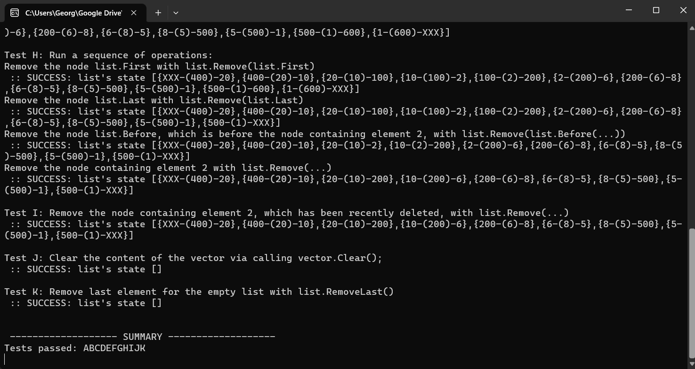

# Doubly Linked List Implementation

Overview
This repository contains the implementation of a doubly linked list in C#. The doubly linked list includes basic operations such as adding elements, removing elements, finding elements, and more.

## Implementation Details

### [DoublyLinkedList Class](doublylinkedlists/DoublyLinkedList.cs)

The `DoublyLinkedList<T>` class represents a doubly linked list with nodes containing elements of type `T`. It includes methods for adding, removing, finding, and manipulating nodes within the list.

#### Public Methods and Properties

- `First`: Gets the first node in the doubly linked list.
- `Last`: Gets the last node in the doubly linked list.
- `After(INode<T> node)`: Gets the node after the specified node.
- `Before(INode<T> node)`: Gets the node before the specified node.
- `AddLast(T value)`: Adds a new node with the specified value at the end of the list.
- `AddFirst(T value)`: Adds a new node with the specified value at the beginning of the list.
- `AddBefore(INode<T> before, T value)`: Adds a new node with the specified value before the specified node.
- `AddAfter(INode<T> after, T value)`: Adds a new node with the specified value after the specified node.
- `Find(T value)`: Finds the first occurrence of a node with the specified value.
- `Remove(INode<T> node)`: Removes the specified node from the list.
- `RemoveFirst()`: Removes the first node from the list.
- `RemoveLast()`: Removes the last node from the list.
- `Clear()`: Removes all nodes from the list.

### [INode Interface](Doublylinkedlists/INode.cs)

The `INode<T>` interface represents a node in the doubly linked list. It includes a property to get or set the value of the node.

## Usage

1. Download the source code and open it in Microsoft Visual Studio.
2. Compile and run the [Tester](Doublylinkedlists/Tester.cs) class to perform a sequence of tests on the `DoublyLinkedList<T>` implementation.

## Testing

The [Tester](Doublylinkedlists/Tester.cs) class provides a set of tests to validate the correctness of each operation in the `DoublyLinkedList<T>` class. Ensure that all tests pass successfully before submission.

## Notes

- The `DoublyLinkedList<T>` class uses two auxiliary nodes, `Head` and `Tail`, to simplify the implementation.
- Follow the provided guidelines and explore additional resources for understanding doubly linked lists and object-oriented programming concepts.

## Example

Refer to the image above for an example of the doubly linked list's correct state after running the provided tests.

