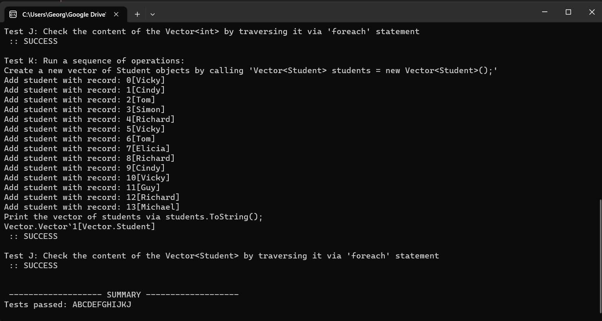

# Iteration and Search

### Overview
This repository contains C# implementations for iteration and search algorithms. The primary class, `Vector<T>`, provides functionality for working with a dynamic array, including methods for sorting, binary search, and more.

## Project Structure

### Files

- [4.1Iterationandsearch.csproj](4.1Iterationandsearch/4.1Iterationandsearch.csproj): Project file.
- [ISorter.cs](4.1Iterationandsearch/ISorter.cs): Interface defining sorting methods.
- [Tester.cs](4.1Iterationandsearch/Tester.cs): Class with test scenarios for vector operations.
- [Vector.cs](4.1Iterationandsearch/Vector.cs): Implementation of the `Vector<T>` class.

## Vector<T> Class

### Methods

1. **`Add(T element)`**
   - Adds a new element to the vector. If the internal array is at capacity, it extends the capacity.
   - Example Usage:
     ```csharp
     Vector<int> vector = new Vector<int>();
     vector.Add(42);
     ```

2. **`Sort()`**
   - Sorts the elements in ascending order using the default sorting algorithm.
   - Example Usage:
     ```csharp
     Vector<int> vector = new Vector<int> { 5, 2, 8, 1, 4 };
     vector.Sort();
     ```

3. **`BinarySearch(T element)`**
   - Performs a binary search for the specified element and returns its index if found, otherwise -1.
   - Example Usage:
     ```csharp
     Vector<int> vector = new Vector<int> { 1, 2, 4, 5, 8 };
     int index = vector.BinarySearch(4);
     ```

4. **`IndexOf(T element)`**
   - Finds the index of the first occurrence of the specified element using linear search.
   - Example Usage:
     ```csharp
     Vector<int> vector = new Vector<int> { 1, 2, 4, 5, 8 };
     int index = vector.IndexOf(4);
     ```

5. **`GetEnumerator()`**
   - Returns an enumerator that iterates through the vector.
   - Example Usage:
     ```csharp
     Vector<int> vector = new Vector<int> { 1, 2, 4, 5, 8 };
     IEnumerator<int> enumerator = vector.GetEnumerator();
     ```

### ISorter Interface

1. **`Sort<K>(K[] sequence, IComparer<K> comparer)`**
   - Sorts a sequence using the specified comparer. It is implemented by sorting algorithms in `Vector<T>`.
   - Example Usage:
     ```csharp
     ISorter sorter = new DefaultSorter();
     int[] array = { 5, 2, 8, 1, 4 };
     sorter.Sort(array, new AscendingIntComparer());
     ```

2. **`DefaultSorter` Class**
   - The default sorter implementation within the `ISorter` interface, using `Array.Sort()`.

## Testing
Run the test scenarios provided in [Tester.cs](4.1Iterationandsearch/Tester.cs) to validate the correctness of the `Vector<T>` implementation.

## Example



## Notes
- Customize and expand the test scenarios to cover various use cases.
- Follow object-oriented programming principles for clear and maintainable code.

Feel free to explore and contribute!
